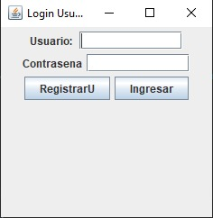
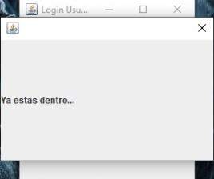
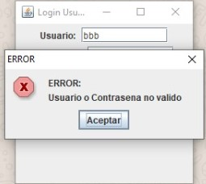
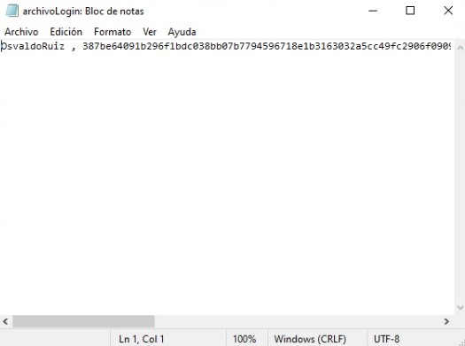

# Programa de Control de Acceso

Problematica que se desarrollo:

*Se desarrollo un programa que implementa una aplicacion con GUI capaz de registrar usuarios y permitirles el acceso a una ventana secudaria sencilla mediante su usuario y contraseña previamente registrados. La contraseña y el usuario se guardan en un archivo de extención ".txt", la contraseña se guarda con un encriptado SHA-256.*

# Link de funcionamiento del programa

~https://flipgrid.com/s/8LD9Wt_s4-aEucVP

~https://www.youtube.com/watch?v=MFGBrkox7Yg&feature=youtu.be

# Elementos visuales y funcionamiento

~Una casilla JTextField que sirve para introducir el Usuario.

~Una casilla tipo JPasswordField que sirve para introducir la contraseña.

~Dos Etiquetas que hacen referencia a la casilla correspondiente.

~Un botón (*RegistrarU*) para registrar un Usuario y contraseña. La informacion la guarda en un archivo .txt.

~Un boton para ingresar (*Ingresar*) que verifica que los datos ingresados son iguales a los datos registrados y guardados en el .txt.

# -Pre-requisitos

Para este programa se ocupan librerias propias del lenguaje JAVA (no se ocupo ninguna libreria externa), el repositorio de GitHub y yo use un IDE. Eclipse 2020-06.

# Agradecimientos

- *Carlos Rafael Levy Rojas (Docente de la materia: Topicos Avanzados de Programacion. del Instituto Tecnologico de León ) Por guiarnos y alentarnos a realizar este proyecto*
- *A mi: Por mi esfuerzo y dedicacion para poder realiar este proyeto*

# Referencias
~https://anabelisa.co/readme/

~https://docs.oracle.com/javase/tutorial/uiswing/components/passwordfield.html

~https://trellat.es/codificar-texto-sha-256-java/#:~:text=El%20m%C3%A9todo%20de%20cifrado%20SHA,(digest)%20del%20texto%20original.

~http://chuwiki.chuidiang.org/index.php?title=JFrame_y_JDialog

~https://ictblog.luisalbertogh.net/?p=274

~http://javainutil.blogspot.com/2013/05/java-generar-hash-sha-y-encriptar.html

~https://es.stackoverflow.com/questions/54098/que-algoritmo-de-cifrado-se-puede-usar-para-guardar-datos-en-java

~https://www.youtube.com/watch?v=El939Eu0Z70

~https://www.youtube.com/watch?v=X3UM7xp1AP8

~https://www.discoduroderoer.es/eventos-y-listeners-en-java/

# Resultados

